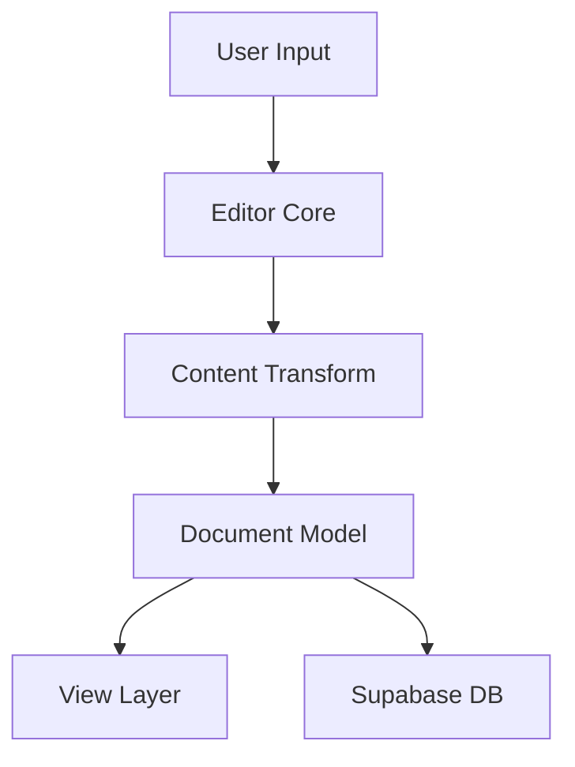
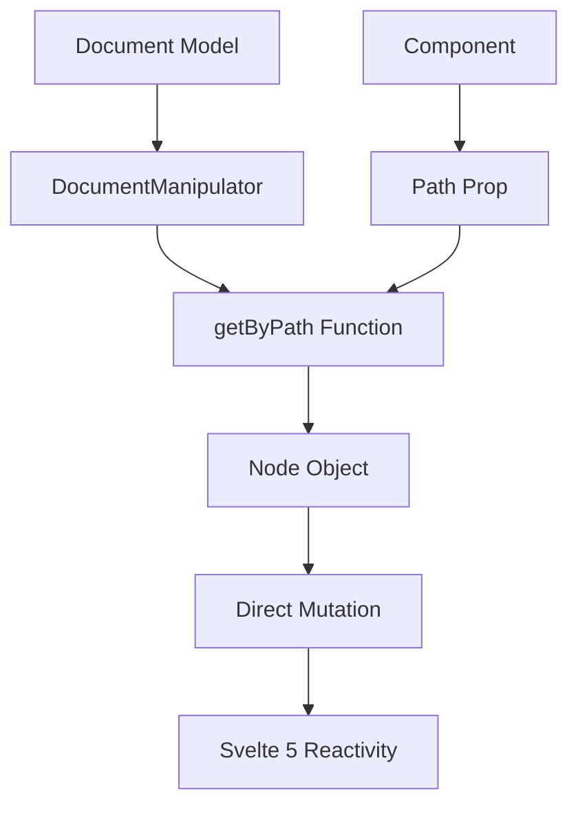
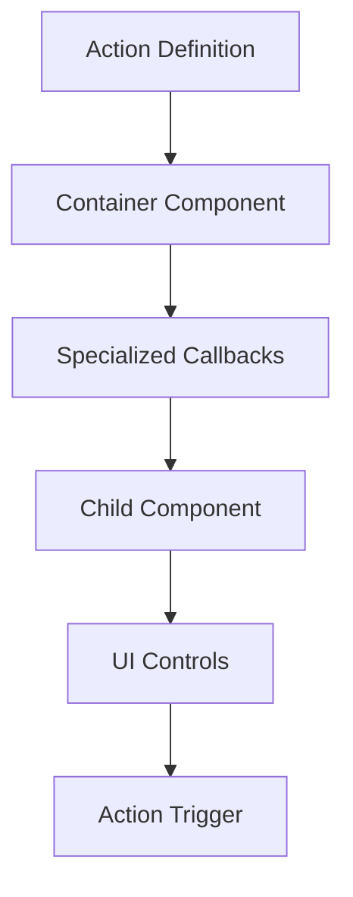
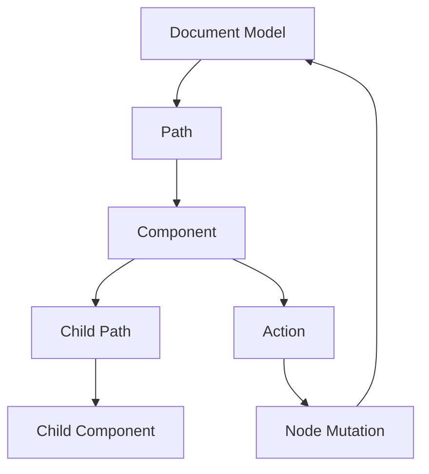

# System Patterns

## Architecture Overview

### Tech Stack
- **Frontend Framework**: SvelteKit
- **Language**: TypeScript
- **Database/Backend**: Supabase
- **Editor Core**: ProseMirror
- **Styling**: Tailwind CSS

## Key Design Patterns

### MVC-like Structure
```
src/
├── lib/
│   ├── model/      # Data models and business logic
│   ├── view/       # UI components and layouts
│   ├── services/   # Core services (e.g., ProseMirror)
│   └── actions/    # Svelte actions for DOM interactions
```

### Component Organization
1. **Collection Pattern**
   - Section containers for different view types
   - Modular controls for each section type
   - Hierarchical structure for nested content

2. **Document Structure**
   - ProseMirror-based editor core
   - Custom content types (Heading, Paragraph)
   - Extensible view registry
   - Title and slug management
   ```mermaid
   flowchart TD
       Title[Document Title] --> Slug[URL Slug]
       Slug --> Unique[Unique per User]
       Title --> UI[TitleInput Component]
       UI --> Save[Save Document]
       Save --> DB[Database]
   ```

### Data Flow


## Core Components

### Editor System
- ProseMirror integration for rich text editing
- Custom extensions for idea transformation
- View registry for component mapping

### Content Organization
- Section-based content structure
- Multiple view types (Card, Table of Contents, Tabs)
- Hierarchical document model
- Section splitting for content reorganization

### UI Components
1. **Section Containers**
   - Card view
   - Table of Contents
   - Tabs interface
   - Default layout

2. **Controls**
   - Section-specific controls
   - Collapse/Expand functionality
   - Content transformation tools
   - Paragraph-to-heading conversion
   ```mermaid
   flowchart TD
       Hover[User Hovers Over Paragraph] --> Controls[Controls Appear]
       Controls --> Click[User Clicks 'H' Button]
       Click --> Convert[Convert Paragraph to Heading]
       Convert --> Split[Split Section]
       Split --> NewSection[Create New Section]
       NewSection --> Insert[Insert After Current Section]
   ```

## State Management
- Document model for state representation
- Path-based component access
- Direct model-view updates
- Supabase real-time updates

### Path-Based Component Access


1. **Centralized State**
   - Document model serves as the single source of truth
   - State is accessed through paths rather than direct references
   - Components only access the parts of the state they need

2. **Path Propagation**
   - Parent components pass paths to child components
   - Child components extend paths for their children
   - Example: `[...path, 'children', index]`

3. **Direct Mutations**
   - Components retrieve nodes using `documentManipulator.getByPath(path)`
   - Direct mutations to retrieved objects trigger reactivity
   - No need for explicit setters due to Svelte 5's reactivity system

## Extension Points
1. **View Types**
   - New section containers
   - Custom controls
   - Content transformations

2. **Content Types**
   - Custom content blocks
   - Specialized formatters
   - Transform plugins
   - Content conversion operations

## Security Patterns
- Supabase authentication
- Row-level security
- Content permissions
- Unique document constraints per user

## Document Identification
1. **Title System**
   - User-friendly document titles
   - Automatic slug generation
   - Unique per user constraint
   - Real-time title updates

2. **URL Structure**
   - Username-based paths (e.g., /username/document-slug)
   - Slug-based document identification
   - Human-readable URLs
   - Unique document URLs per user

## Action Patterns

### Component Hierarchy Pattern


### Path-Based Component Pattern


3. **Path-Based Access**
   - Components receive paths instead of direct node references
   - Components access nodes through the DocumentManipulator
   - Actions operate on node objects retrieved by path
   - Changes to nodes are automatically reactive
